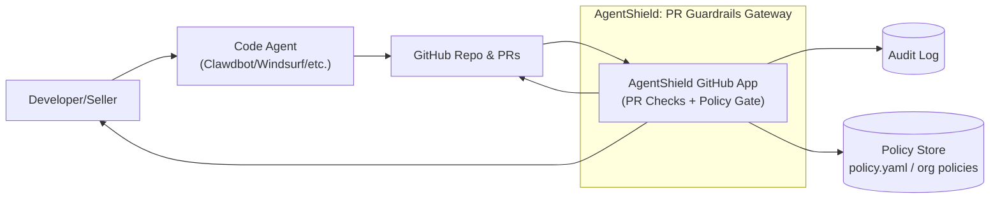
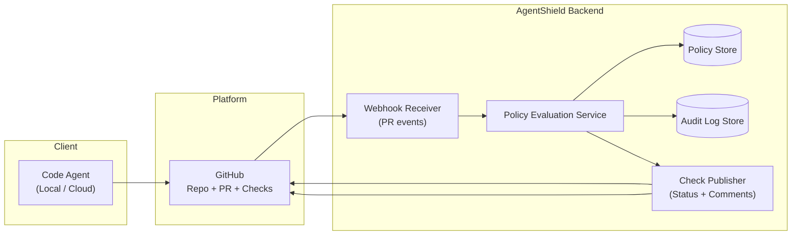
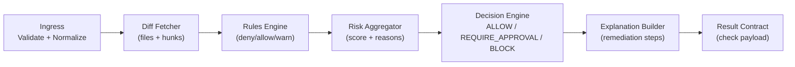
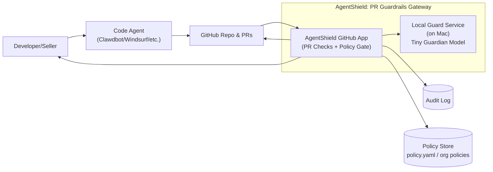
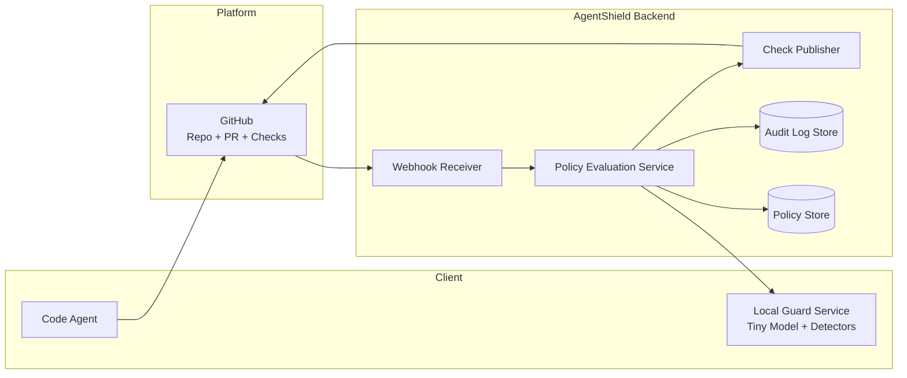
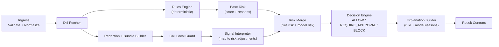
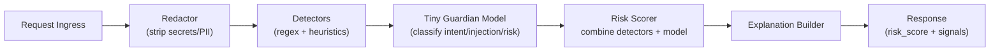

# Agent Gateway Design (C4) — Repo/PR Guardrails Wedge

This document provides a **simple, high‑level C4-style architecture** for a GitHub-first “Agent Security Gateway” that gates *agent-driven repo changes* (PRs) using **policy rules** and optional **local LLM-based guard analysis**.

It includes **two scenarios**:
1) **No LLM** (rules/templates only)  
2) **With LLM** (rules + local “guardian” model for risk signals)

---

## Scope: One most valuable use case

**Use case:** An AI agent (Clawdbot/Windsurf/etc.) opens or updates a PR.  
**Goal:** Gate risky PR changes (CI/workflows, dependency bumps, secrets, destructive edits) using explicit policy; optionally add a local model to detect manipulation / prompt-injection patterns and other fuzzy signals.

---

## Fitness Functions (Architectural Guardrails)

These are measurable constraints—treat them as non-negotiable:

1) **Determinism First**  
   - If policy rules can decide, they decide.  
   - (With LLM) model can **escalate** risk, not silently “allow”.

2) **Fail Safe**  
   - If key components are unavailable (e.g., local guard), degrade to **Require Approval** (never auto-allow).

3) **Explainability Required**  
   - Any block/approval must include a human-readable explanation:
     - triggered rule(s)
     - model signal(s) (if enabled)
     - actionable remediation (“split workflow edits into separate PR”, etc.)

---

# Scenario 1 — **No LLM** (Policy-only)

## C4 Level 1: System Context

### Context Notes
- The “gateway” is implemented primarily as a **GitHub App** that runs checks on PR events.
- The agent is treated as untrusted—even if initiated by a trusted developer.

---

## C4 Level 2: Containers

### Container Responsibilities
- **Webhook Receiver**: validates GitHub events; loads PR metadata/diff
- **Policy Evaluation Service**: deterministic gating via rules
- **Check Publisher**: posts “pass/warn/fail” with explanations
- **Policy Store**: repo or org policies (YAML), versioned
- **Audit Log Store**: append-only audit records

---

## C4 Level 3: Components (inside Policy Evaluation Service)

### Example Deterministic Rules
- **Block** PRs modifying `.github/workflows/**` unless label `security-approved`
- **Require approval** if `package.json` or lockfiles bump major versions
- **Block** if secrets-like patterns are detected (regex-based)
- **Warn** for edits to infra/config directories (e.g., `terraform/**`, `k8s/**`)

---

## Primary Flow (No LLM)
1. PR opened/updated → GitHub webhook triggers AgentShield
2. Fetch diff + metadata → evaluate deterministic policies
3. Produce decision:
   - ✅ Allow (check passes)
   - 🟡 Require Approval (check warns + instructions)
   - ❌ Block (check fails + explanation)
4. Store audit log

---

# Scenario 2 — **With LLM** (Policy + Local Guardian Model)

## What changes?
We add a **Local Guard Service** that runs on the developer’s Mac (Apple Silicon-friendly).  
It performs fast “guardian” analysis and returns **signals** that can *escalate* risk.

Important constraints:
- Model **does not invent facts**; it provides risk signals only.
- If the guard is unavailable, system degrades to **Require Approval**.

---

## C4 Level 1: System Context

---

## C4 Level 2: Containers

### Local Guard Service Inputs (redacted bundle)
- PR title/body (and linked issue excerpts if configured)
- filenames + limited diff hunks (size-capped)
- repo policy context (allowed domains, protected paths)
- optionally: “retrieved external sources” metadata if your agent uses web retrieval

### Outputs
- `risk_score` (0–1)
- `signals[]` (e.g., “instruction override patterns”, “exfil intent”, “suspicious shell commands in diff”)
- `explain` text (short, human-readable)
- `confidence`

---

## C4 Level 3: Components

### 3A) Policy Evaluation Service (with LLM signals)

**Decision principle:** model can only push toward *more caution*:
- `ALLOW` can become `REQUIRE_APPROVAL` or `BLOCK`
- `BLOCK` remains `BLOCK`
- The model cannot “waive” policy blocks

---

### 3B) Local Guard Service Components

#### Typical Signals (examples)
- Prompt-injection / instruction override language in PR or linked issue
- Attempts to modify CI to exfiltrate secrets (e.g., `curl $GITHUB_TOKEN ...`)
- Dependency bumps from unknown publishers or suspicious registry changes
- Shell/script additions that look like persistence or data exfiltration
- “Disable security checks” patterns

---

## Primary Flow (With LLM)
1. PR opened/updated → AgentShield fetches diff + metadata
2. Deterministic policy evaluation runs immediately
3. Build redacted bundle → call local guard service
4. Merge risks:
   - Rules decide the floor; model may escalate
5. Publish check result + explanation, log audit

---

# Appendix — Minimal “Policy YAML” Concept (for MVP)

This is not a full schema, just a starter concept:

- **Paths**
  - deny patterns (workflows, secrets, infra)
  - warn patterns (deps, configs)

- **Dependency rules**
  - require approval on major bumps
  - deny registry changes

- **Secrets**
  - block on regex + entropy patterns

- **Approvals**
  - CODEOWNERS mapping or GitHub review requirements

---

# Appendix — “Fail Safe” Modes

- **Local Guard down/unreachable**
  - Degrade to: `REQUIRE_APPROVAL` for medium/high risk PRs
  - Never auto-allow on uncertain cases

- **GitHub API rate-limited**
  - Post “deferred check” or require manual review (depending on org appetite)

---

# Appendix — What this is NOT (to avoid Fortify overlap)

- Not SAST scanning for vulnerabilities
- Not code-quality linting
- Not “fix my code” assistant

This is **runtime governance & policy enforcement** around **agent actions**.
