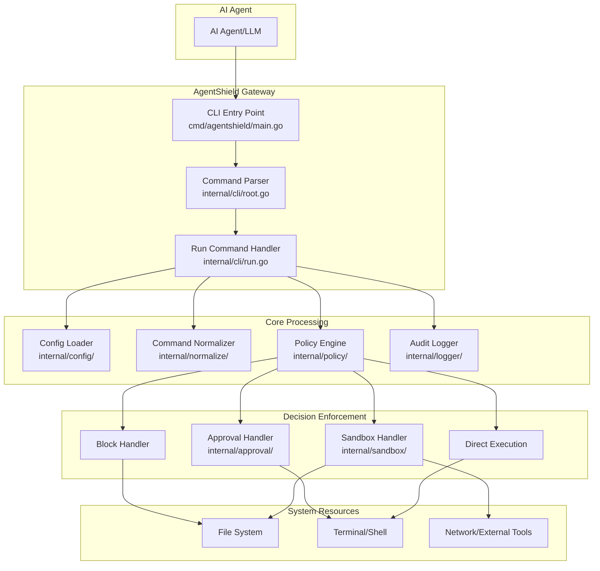
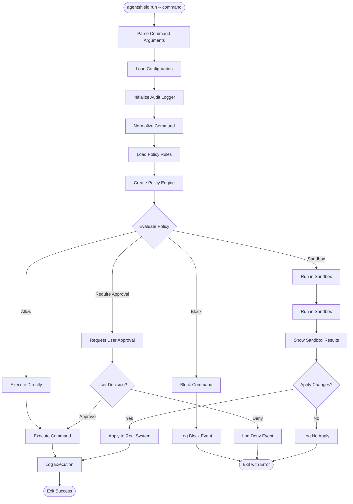
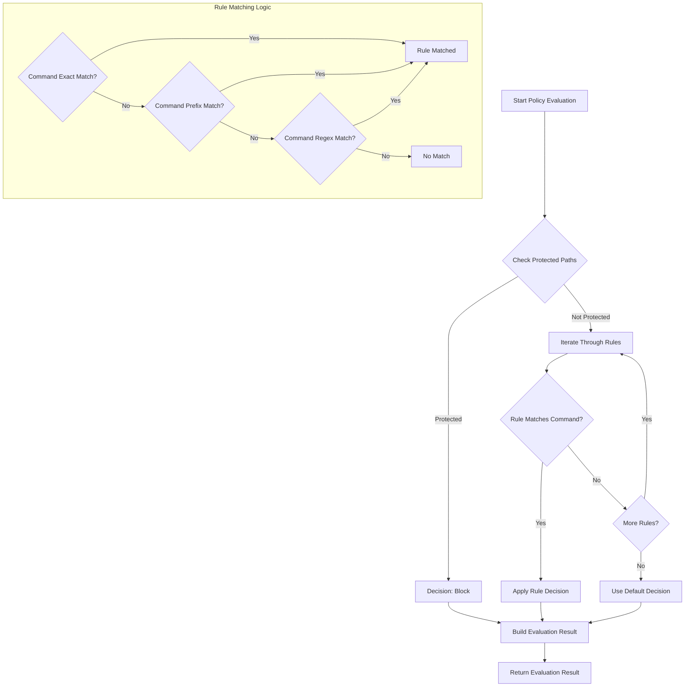
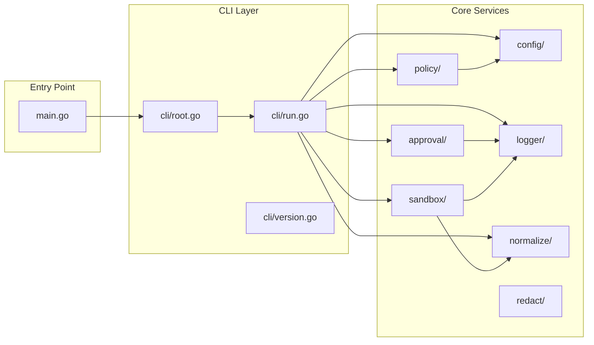
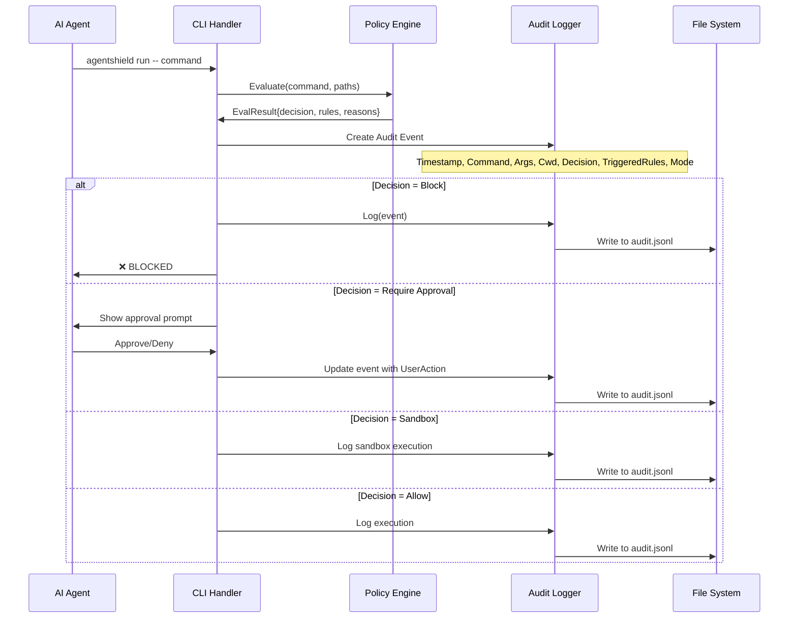

# AgentShield Architecture & Development Guide

## Overview

AgentShield is a local-first security gateway that sits between AI agents and high-risk tools, enforcing deterministic policies to prevent prompt-injection-driven damage, data exfiltration, and destructive actions.

## Architecture Flow Diagrams

### 1. High-Level System Architecture

### 2. Command Execution Flow

### 3. Policy Engine Decision Flow

### 4. Internal Package Dependencies

### 5. Data Flow for Audit Logging

## Key Components Explained

### Main Entry Point (`cmd/agentshield/main.go`)
- Simple entry point that delegates to CLI package
- Handles error reporting and exit codes

### CLI Package (`internal/cli/`)
- **root.go**: Defines main CLI structure using Cobra framework
- **run.go**: Core command execution logic with policy enforcement
- **version.go**: Version information

### Core Processing Packages

#### Config (`internal/config/`)
- Loads configuration from default locations or user-specified paths
- Manages policy and log file paths
- Creates `.agentshield` directory in user home

#### Policy Engine (`internal/policy/`)
- **engine.go**: Core policy evaluation logic
- **loader.go**: Policy file loading from YAML
- **types.go**: Policy data structures
- Rule matching supports exact match, prefix match, and regex patterns
- Protected path checking with glob patterns

#### Normalizer (`internal/normalize/`)
- Extracts file paths from commands
- Normalizes relative paths to absolute paths
- Handles path expansion and resolution

#### Sandbox (`internal/sandbox/`)
- Creates isolated environments for command execution
- Captures file system changes
- Provides diff summaries for user review
- Applies approved changes to real system

#### Approval (`internal/approval/`)
- Interactive user prompts for approval decisions
- Formats approval requests with rule explanations
- Captures user actions for audit logging

#### Logger (`internal/logger/`)
- Structured audit logging in JSONL format
- Tracks all command executions and decisions
- Provides security audit trail

#### Redact (`internal/redact/`)
- Sensitive data redaction for logging
- Prevents secrets from appearing in audit logs

## Development Workflow

1. **Policy Development**: Create YAML policy files with rules and protected paths
2. **Testing**: Use sandbox mode to preview changes
3. **Audit Review**: Monitor audit logs for security events
4. **Configuration**: Customize paths and modes as needed

## Security Model

- **Defense in Depth**: Multiple layers of security checks
- **Fail Safe**: Default to blocking when uncertain
- **Audit Trail**: Complete logging of all actions
- **User Control**: Approval workflows for risky operations
- **Sandboxing**: Isolated execution for preview capabilities
